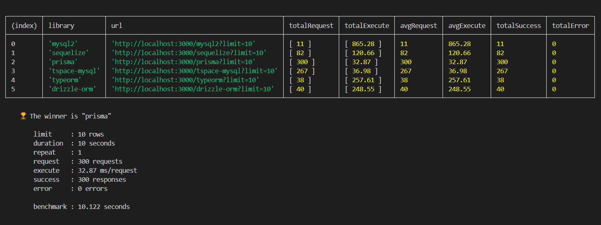
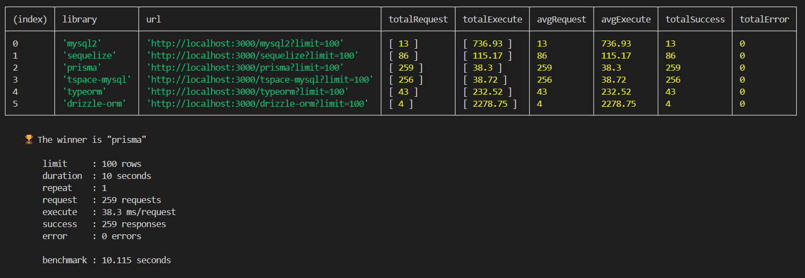
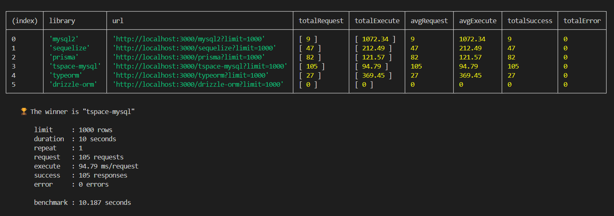
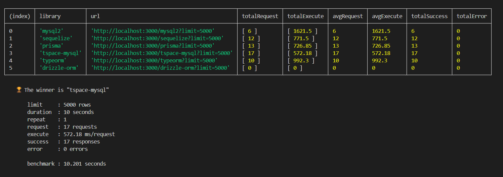
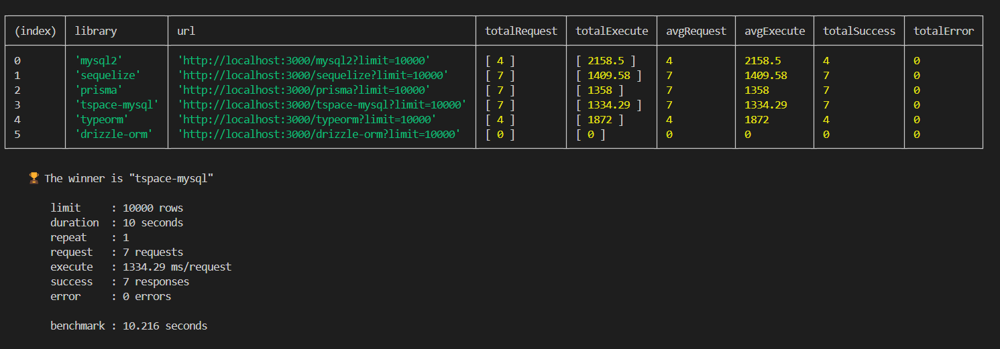

# Benchmark ORM
Benchmark ORM using database mysql

library  : 6 lib(s)
- mysql2 (pure query)
- sequelize
- typeorm
- prisma
- tspace-mysql
- drizzle

use the database from db/benchmark.sql
- table users data for test 40,000 rows 
- table posts data for test 40,000 rows

```js
The data expect
{
    "users": [
        {
            "id": 'number',
            "name": 'string',
            "email": 'string',
            "posts": [
                "id": 'number',
                "userId": 'number',
                "title": 'string',
            ]
        }
        // ....
    ]
}

```

```sh
npm install
npx prisma generate
npm start

npm test -- --d=5 --w=2 --r=3 --l=1000
# @arg {number} --d=5      - benchmark using duration 5 seconds / lib
# @arg {number} --w=2      - waiting after benchmark  2 seconds/ lib
# @arg {number} --r=3      - repeat the benchmark for 3 count
# @arg {number} --l=1000   - limit 1000 results for benchmark

```

## Images Benchmark

Server: mysql via TCP/IP
Server type: MySQL
Server version: 8.0.33 - MySQL Community Server - GPL
Protocol version: 10
Server charset: UTF-8 Unicode (utf8mb4)

benchmark in 10 seconds with limit 10 rows


benchmark in 10 seconds with limit 100 rows


benchmark in 10 seconds with limit 500 rows


benchmark in 10 seconds with limit 1000 rows


benchmark in 10 seconds with limit 5000 rows


benchmark in 10 seconds with limit 10000 rows


benchmark in 10 seconds with limit 20000 rows


benchmark in 10 seconds with limit 30000 rows
